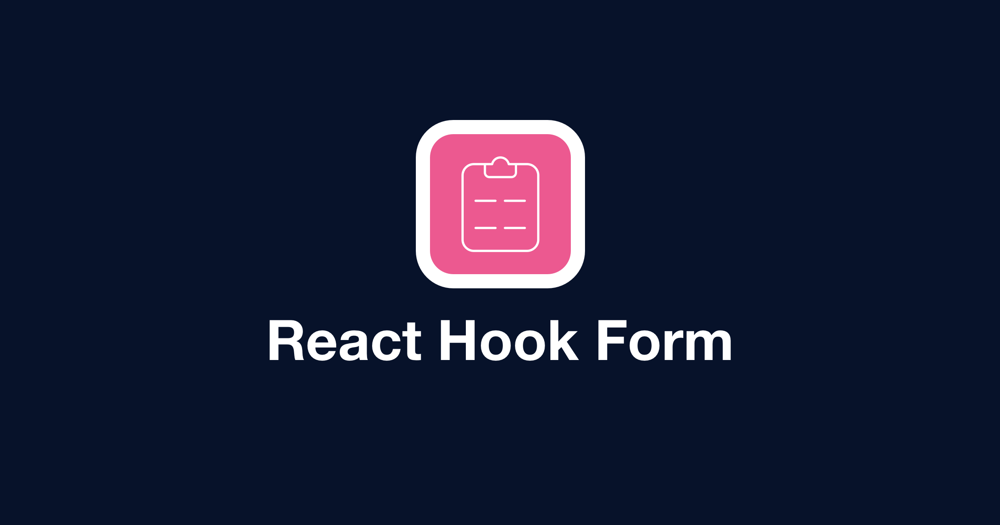
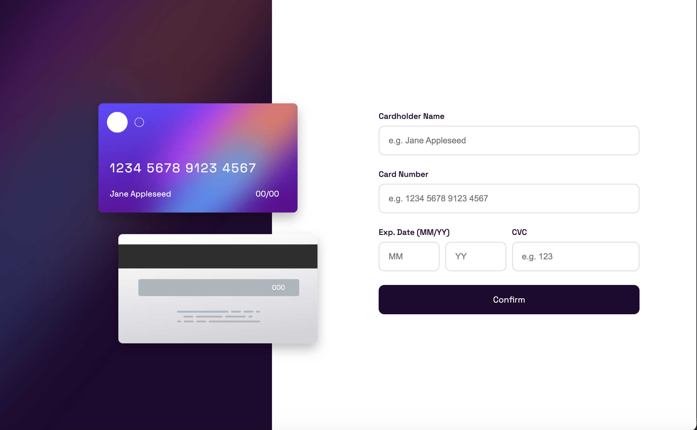

# Credit Card | Form Validation

    

## Vista en vivo

<ul>
    <li>
        <a target="_blank" href="">Vista en vivo</a>
    </li>
</ul>

## Descripción 📑

Este proyecto consiste en una interfaz web que desarrollé con React para validar formularios de tarjeta de crédito. La aplicación permite ingresar datos como el nombre del titular, número de tarjeta, fecha de expiración y código CVC, y se encarga de validar la información en tiempo real.

Para los estilos utilicé la librería Styled Components, lo que me permitió estructurar el diseño de forma modular y clara. Para la validación del formulario implementé React Hook Form, que facilitó mucho el manejo de los inputs y las reglas de validación.

El objetivo principal de este proyecto fue practicar y afianzar conceptos de React, especialmente relacionados con formularios, manejo de estado y diseño de interfaces modernas y funcionales.

## ¿Qué he aprendido en este proyecto? 🙇🏻

Este proyecto lo realicé por segunda vez. La primera vez lo hice con JavaScript puro, pero en esta ocasión decidí recrearlo con React, incorporando herramientas como Styled Components y React Hook Form por primera vez.

Aunque fue un reto trabajar con estas librerías nuevas para mí, descubrí que la validación de datos fue mucho más eficiente y limpia utilizando React Hook Form. Me ayudó a entender mejor cómo optimizar formularios y evitar lógica redundante.

Además, este ejercicio me permitió seguir practicando el manejo de estado en React y mejorar mi habilidad para aplicar Styled Components de forma más organizada. En general, fue una experiencia muy valiosa que me permitió consolidar mis conocimientos y avanzar en mi aprendizaje como desarrollador frontend.

## Tecnologías 🛠

<!-- Iconos sacados de: https://github.com/alexandresanlim/Badges4-README.md-Profile?tab=readme-ov-file#-languages- -->

    
    

## Capturas del proyecto

   
   
   

## Autor ✒️

Begoña Calleja Zardain

<ul>
    <li>
        <a href="begoxcz@hotmail.com">begoxcz@hotmail.com</a>
    </li>
    <li>
        <a href="www.linkedin.com/in/begona-calleja-zardain">LinkedIn</a>
    </li>
    <li>
        <a href="www.begocallejazardain.com">Porfolio web</a>
    </li>
</ul>

## Link del reto (si es público)

<a href="https://www.frontendmentor.io/challenges/interactive-card-details-form-XpS8cKZDWw">Frontendmentor</a>

## Instalación

Este proyecto está construido con Vite.

- Para editarlo ejecuta el comando <b>npm run dev</b>
- Para construir la versión de producción ejecuta el comando <b>npm run build</b>
- Para previsualizar la versión final ejecuta el comando <b>npm run preview</b>
